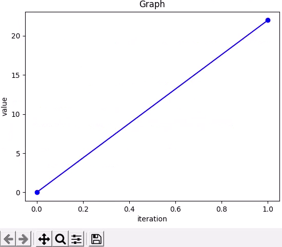
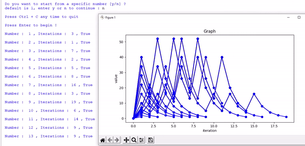

# Collatz Conjecture
The [Collatz Conjecture](https://en.m.wikipedia.org/wiki/Collatz_conjecture) or hailstone sequence is presented in an **interactive** computer programme to calculate the sequence.</br> 
The sequence is generated by starting with any **positive whole number** greater than zero and following two **rules.**
1. If the number is odd, then multiply by three and add one ( x3+1)
2. If the number is even, then divide by two (/2)

The sequence will continue till *infinity* due to its nature. However, the programme detects the lowest number in the series, which is 1 and stops.</br>
It also shows values like, number of **iterations** and **graph** of the generated sequence.</br>

**Prerequisites:**
* Your computer must be running Python3.9 or newer

### Dependencies
* Below is the library that has been used to plot graphs, it should be installed before executing the programme
```

pip install matplotlib

```
#

### 1. Demo ⏯️

```

Pick a number & Press enter 1 2 3 4 5 6 7 8 9... >>>  7


7  Good choice.

Press Enter to begin !

-> 22 11 34 17 52 26 13 40 20 10 5 16 8 4 2 1

Iterations :  16

```


The [programme](scripts/main.py) follows the rules and generates a sequence, where the lowest number is one.</br>
The conjecture is: every positive integer, if you apply these rules, will eventually end up in the 4, 2, 1 loop.
#
### How?

Here, **1** is odd, multiply by three and add one.</br>
Which equals **4**.</br>
Even, divide by two, **2**, still even.</br>
Divide by two, **1**, odd.</br>
So, **1** goes to **4**, goes to **2**, goes to **1**.</br>

We're in loop and the lowest number is **1**.</br>
#

This is Commonly called the Collatz conjecture, and the numbers obtained by applying **3x+1** are called **hailstone numbers**, because  they go up and down like hailstones in a thundercloud, but eventually they all fall down to one.</br>


In above demonstration the number is 7. In total, it takes **16 steps/iterations** to get down to one, and end up in the four, two, one loop.</br>
 Now the **paths** that different numbers take **vary so widely**, below the graph shows the path of number seven.

#

#


## Collatz Conjecture (_infinite_)

The below [programme](scripts/infinite_live_main.py) is written in a way that, it will loop itself to ***infinity***.</br>
It repeats indefinitely, going through all the possible positive integer **(1, 2, 3, 4.....)** one after one, automatically once initiated.</br>

It has all the features and follws the same rules for calculation and plot the graph of generated sequence live, also ask to the user whether to start from a **given number** or from default, which is ***1***.</br>

If the number falls in the loop of **4, 2, 1** ,then it returns ***True***.</br>
If not then returns ***False*** ( not detected yet ) and will go to the next number.</br>
The programme is a bit slow, and might slow down your computer.
Since it plots the **graph** of every single number simultaneously.

### 2. Demo ⏯️
```

 Do you want to start from a specific number [y/n] ?
 default is 1, enter y or n to continue : n
 
 Press Ctrl + C any time to quit 

 Press Enter to begin ! 

 Number :  1 , Iterations :  3 , True  

 Number :  2 , Iterations :  1 , True  

 Number :  3 , Iterations :  7 , True  

 Number :  4 , Iterations :  2 , True  

  ...........................
  ...................................
```
#

#

**This [programme](scripts/infinite_main.py) is an alternate version of the above infinite [script](scripts/infinite_live_main.py)** 

It has all the features and follows the same rules for calculation and plot the graph of 
generated sequence when it detects **Keyboard Interrupt** Ctrl+C.</br>

The  Programme  is faster than the above script, and does not **plot graphs** every single time, only when user commands it to plot.

### 3. Demo ⏯️
```

 Do you want to start from a specific number [y/n] ?
 default is 1, enter y or n to continue : n
 
 Press Ctrl + C any time to interrupt and to see the plotted graph  

 Press Enter to begin ! 

 Number :  1 , Iterations :  3 , True  

 Number :  2 , Iterations :  1 , True  

 Number :  3 , Iterations :  7 , True  

 Number :  4 , Iterations :  2 , True  

  ...........................
  ...................................
```
#

#


# License

Copyright © Abhijeet Kumar. All rights reserved.

Licensed under the [MIT License.](LICENSE) 
